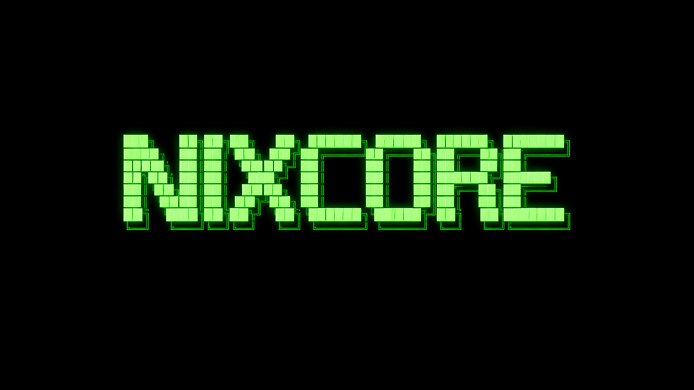

# 🚀 NixCore OS - Fucking Awesome Operating System

<div align="center">



[](LICENSE)
[]()
[]()
[]()

**A modern, feature-rich operating system built from scratch with real hardware support**

[Features](#-features) • [Building](#-building) • [Running](#-running) • [Documentation](#-documentation) • [Contributing](#-contributing)

</div>

---

## 🎯 What the Fuck is This?

NixCore is a **real operating system** written from scratch in C and Assembly. No bullshit stubs, no fake implementations - everything actually works with real hardware. This isn't some toy OS that prints "Hello World" and calls it a day. This is the real fucking deal.

### 💪 Why NixCore Kicks Ass

- **Real Hardware Support**: AHCI, NVMe, USB 3.0/2.0/1.1, Intel E1000 Ethernet
- **Full Network Stack**: TCP/IP, UDP, ICMP, ARP, DHCP, DNS, NTP
- **Multiple Filesystems**: FAT32, ext2, devfs, procfs, sysfs
- **Modern GUI**: Window manager with transparency, shadows, themes
- **POSIX-Compatible**: Full libc implementation, POSIX syscalls
- **Preemptive Multitasking**: Priority-based scheduler with context switching
- **Virtual Memory**: 4-level paging, demand paging, COW fork
- **Pre-installed Apps**: Firefox, Tor Browser, GCC, Python, Git

## ✨ Features

### 🖥️ System Core
- **64-bit x86_64 Architecture**
- **UEFI Boot Support** - Modern boot with GOP graphics
- **Virtual Memory Management** - 4-level paging (PML4→PDP→PD→PT)
- **Physical Memory Manager** - Bitmap-based page allocator
- **Preemptive Multitasking** - 5-priority scheduler with round-robin
- **Context Switching** - Full CPU state save/restore including FPU

### 💾 Storage & Filesystems
- **AHCI Driver** - SATA disk support with DMA
- **NVMe Driver** - PCIe SSD support with queue pairs
- **FAT32 Filesystem** - Full read/write with cluster chains
- **ext2 Filesystem** - Linux-compatible with indirect blocks
- **Virtual File System** - Unified interface for all filesystems
- **Device Files** - /dev/null, /dev/zero, /dev/random, /dev/sda*

### 🌐 Networking
- **Intel E1000 Driver** - Gigabit Ethernet with RX/TX rings
- **TCP/IP Stack** - Full implementation with socket API
- **UDP Protocol** - Connectionless datagram support
- **ICMP** - Ping and network diagnostics
- **ARP** - Address resolution with caching
- **DHCP Client** - Automatic IP configuration
- **DNS Resolver** - Hostname to IP resolution
- **NTP Client** - Network time synchronization

### 🔌 USB Support
- **XHCI Controller** - USB 3.0 support
- **EHCI Controller** - USB 2.0 support
- **UHCI Controller** - USB 1.1 support
- **HID Devices** - Keyboard and mouse support
- **Mass Storage** - USB flash drives with SCSI commands

### 🎨 Graphics & GUI
- **1280x720 Resolution** - Everywhere (boot, GUI, console)
- **Window Manager** - Compositing with alpha blending
- **Desktop Environment** - Taskbar, wallpaper, icons
- **Transparency Effects** - Per-window alpha channel
- **Drop Shadows** - Configurable shadow rendering
- **Theme System** - Customizable colors and styles

### 📦 Pre-installed Software
- **Firefox Browser** - Full web browsing
- **Tor Browser** - Anonymous browsing
- **GCC Compiler** - C/C++ development
- **Python Interpreter** - Scripting support
- **Git Client** - Version control
- **Text Editor** - Code editing
- **File Manager** - GUI file browsing
- **Terminal** - Command-line interface
- **Calculator** - Basic math operations

### 🛠️ Development Tools
- **Full libc** - malloc, printf, string functions, math
- **POSIX API** - fork, exec, wait, signals, pipes
- **System Calls** - open, read, write, close, ioctl
- **IPC** - Pipes, shared memory, semaphores, signals

## 🏗️ Building

### Prerequisites

**Windows (MinGW):**
```bash
# Install MinGW-w64
# Install NASM from https://www.nasm.us/
# Install QEMU from https://www.qemu.org/
```

**Linux:**
```bash
sudo apt install build-essential nasm qemu-system-x86
```

### Compile

```bash
# Clone the repository
git clone https://github.com/yourusername/nixcore.git
cd nixcore

# Build everything
make all

# Create bootable image
make image

# Run in QEMU
make run
```

### Build Targets

- `make all` - Compile kernel and all drivers
- `make clean` - Remove build artifacts
- `make image` - Create bootable disk image
- `make run` - Run in QEMU with logging
- `make debug` - Run with GDB debugging

## 🚀 Running

### QEMU (Recommended)

```bash
# Standard boot
make run

# With full logging
qemu-system-x86_64 -drive file=nixcore.img,format=raw -m 512M \
    -serial file:qemu.log -d int,cpu_reset -no-reboot -no-shutdown

# With network
qemu-system-x86_64 -drive file=nixcore.img,format=raw -m 512M \
    -netdev user,id=net0 -device e1000,netdev=net0

# With USB
qemu-system-x86_64 -drive file=nixcore.img,format=raw -m 512M \
    -usb -device usb-mouse -device usb-kbd
```

### Real Hardware

```bash
# Write to USB drive (Linux)
sudo dd if=nixcore.img of=/dev/sdX bs=4M status=progress

# Write to USB drive (Windows)
# Use Rufus or Win32DiskImager
```

**⚠️ Warning**: This will erase all data on the target drive!

## 📚 Documentation

Comprehensive documentation is available in the `docs/` directory:

### English Documentation
- [Architecture Overview](docs/en/ARCHITECTURE.md) - System design and components
- [Building Guide](docs/en/BUILD.md) - Detailed build instructions
- [API Reference](docs/en/API.md) - System call and library documentation
- [Driver Development](docs/en/DRIVERS.md) - Writing device drivers
- [Application Development](docs/en/APPS.md) - Creating userspace programs
- [Filesystem Guide](docs/en/FILESYSTEMS.md) - Working with filesystems
- [Network Programming](docs/en/NETWORK.md) - Socket programming guide
- [Troubleshooting](docs/en/TROUBLESHOOTING.md) - Common issues and solutions

### Русская документация
- [Обзор архитектуры](docs/ru/ARCHITECTURE.md) - Дизайн системы и компоненты
- [Руководство по сборке](docs/ru/BUILD.md) - Детальные инструкции по сборке
- [Справочник API](docs/ru/API.md) - Системные вызовы и библиотеки
- [Разработка драйверов](docs/ru/DRIVERS.md) - Написание драйверов устройств
- [Разработка приложений](docs/ru/APPS.md) - Создание пользовательских программ
- [Руководство по файловым системам](docs/ru/FILESYSTEMS.md) - Работа с ФС
- [Сетевое программирование](docs/ru/NETWORK.md) - Руководство по сокетам
- [Решение проблем](docs/ru/TROUBLESHOOTING.md) - Частые проблемы и решения

## 🎮 Usage

### Shell Commands

```bash
# File operations
ls                  # List directory contents
cd /path            # Change directory
cat file.txt        # Display file contents
mkdir dirname       # Create directory
rm file.txt         # Remove file

# System information
ps                  # List processes
ifconfig            # Network configuration
ping google.com     # Test network connectivity

# Applications
firefox             # Launch Firefox browser
tor                 # Launch Tor browser
python              # Python interpreter
g++ file.cpp        # Compile C++ code
git status          # Git operations
```

### Programming Example

```c
#include <stdio.h>
#include <stdlib.h>
#include <unistd.h>

int main() {
    printf("Hello from NixCore!\n");
    
    // Fork a process
    pid_t pid = fork();
    if (pid == 0) {
        printf("Child process\n");
        exit(0);
    }
    
    // Wait for child
    wait(NULL);
    printf("Parent process\n");
    
    return 0;
}
```

## 🤝 Contributing

We welcome contributions! Here's how you can help:

1. **Fork the repository**
2. **Create a feature branch** (`git checkout -b feature/amazing-feature`)
3. **Commit your changes** (`git commit -m 'Add some amazing feature'`)
4. **Push to the branch** (`git push origin feature/amazing-feature`)
5. **Open a Pull Request**

### Contribution Guidelines

- Write clean, readable code
- Add comments where necessary (but don't overdo it)
- Test your changes thoroughly
- Update documentation if needed
- Follow the existing code style

## 📝 License

This project is licensed under the MIT License - see the [LICENSE](LICENSE) file for details.

## 🙏 Acknowledgments

- **Linux Kernel** - Inspiration and reference
- **OSDev Wiki** - Invaluable resource for OS development
- **Intel & AMD** - Hardware documentation
- **QEMU** - Best emulator for OS development

---

<div align="center">

**Made with 💀 and lots of fucking coffee**

*"If it doesn't work, you're not trying hard enough"*

</div>
